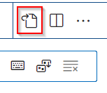

21norm
=======

[21norm](http://github.com/baschnit/21norm) is a python script which tries to automatically resolve many norm errors issued by [norminette](http://github.com/norminette)

## Motivation

When you are studying at 42 you know: once you finished a project you have to correct all norm errors before submitting. This can be quite tedious if you have many files and is it not kind of a stupid thing to go through all the files, replace spaces by tabs or vice versa, remove consecutive newlines and so on?
21norm will try to easen that burden by loading the files, checking for norm errors, and correcting them (if it can).

It cannot correct the most beautiful norm errors:
1. Line too long
2. too many lines in function
3. too many functions in file

## Warning

[21norm](http://github.com/baschnit/21norm) is experimental. It will overwrite your files. There is a chance that it makes changes that will break your code or might even lead to data loss.
I firmly recommend to make a `git add .`, `git commit -m` and `git push` before you run it, so you can return to your old files in case of data loss.

## Usage

Type `21norm` to norm all *.c and *.h files in the current directory. Type `21norm specific_folder/specific_file.c` to norm just that file.

## Installation

### Requirements

norminette must be installed and in the path.

### Download

Clone the git repository [21norm](http://github.com/baschnit/21norm) to a folder, e.g. `/home/<user>/programs/21norm`. Goto `/home/<user>/bin`, create a  symbolic link to the file `21norm.py` in the download folder and make it executable:

```
cd /home/<user>/bin
ln -s /home/<user>/programs/21norm/21norm.py ./21norm
chmod 0100 ./21norm
```

You can now execute `21norm` in your shell. If not, or if the directory `/home/<user>/bin` should not exist, see the [section below](#custom_bin).

### Put ~/bin to $PATH {user_bin}

If there is no folder `/home/<user>/bin` create it:
```
mkdir ~/bin`
```
Check if it is  in the $PATH variable:
```
echo $PATH
```
If not, you can add `export PATH=/home/<user>/bin` to your `~/.zshrc` (or `~/.bashrc` if you are using bash) or to `~/.profile`, regarding your system/needs.

### Add a shortcut for VS Code

Open the file where you can edit the keyboard shortcuts via `File -> Preferences -> Keyboard Shortcuts` and click on the file icon in the upper right corner:



Add the following code at the top. You can also modify the shortcut to your needs (here I chose `CTRL + N`):
```
{
	"key": "ctrl+shift+n",
	"command": "workbench.action.terminal.sendSequence",
	"args": {
		"text": "VSCODE_WD=$(sed 's/\\\\/\\//g' <<< '${fileDirname}' | sed 's/C:/\\/mnt\\/c/g') && cd \"$VSCODE_WD\" && echo \"cd $VSCODE_WD\"\n21norm \"${fileBasename}\"\n"
	}
},
```
After pressing the shorcut, it should activate the latest open terminal, change to the directory where currently opened file resides and run `42check` on it.

If you use VS Code on Windows with WSL (Windows Subsystem for Linux), try this little hack:
```
{
	"key": "ctrl+n",
	"command": "workbench.action.terminal.sendSequence",
	"args": {
		"text": "VSCODE_WD=`sed 's/\\\\\\\\/\\//g' <<< '${fileDirname}' | sed 's/C:/\\/mnt\\/c/g'` cd \"$VSCODE_WD\" && echo \"cd $VSCODE_WD\"\n42checker \"${fileBasename}\"\n"
	}
},
```

## See also

If you like [21norm](http://github.com/baschnit/21norm), you might also like [42check](http://github.com/baschnit/42check), which will reformat the output of [norminette](http://github.com/norminette) to make links with line and column numbers work in VS Code.